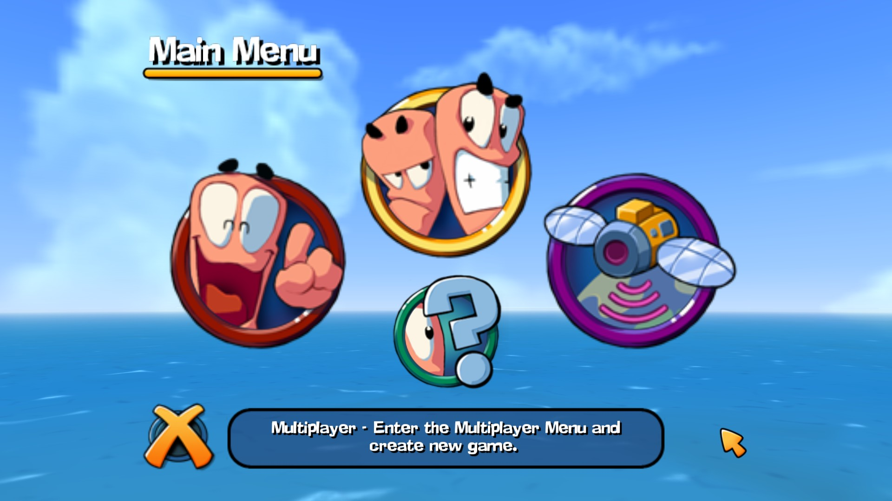

# Worms 3D Anniversary Patch

  

Supported exe versions: **Euro v.1073 DEViANCE**.

## Features

### W3D.Patch

* **AspectRatioFix** - applies aspect ratio patches (Hor+/Vert+)
* **FrameInterval** - changes the delay between frames to help with performance issues
* **NoMusic** - disables background music
* **NoMovies** - disables all movies
* **NoMoviesIntro** - disables intro movies
* **Borderless** - changes windowed borderless mode
* **Host** - changes GameSpy server address (`openspy.net` by default)

### W3D.Input

* Allows to configure key bindings
* **BlimpCamMouseModeSwitch** - switches blimp camera mouse control to movement, as in WF/W4

### W3D.Loader

* Allows to load modified resources without replacing original files  
Place modified xom or tga files in the `Data2` directory

### W3D.Unlimiter

* Allows to expand memory pools
* Allows to change game configuration

## Installation

Copy content of archive to the Worms 3D game directory.

Check the ini files for available features.

## Screenshots

<b>Title</b>

<b>Frontend</b>

<b>In game</b>

